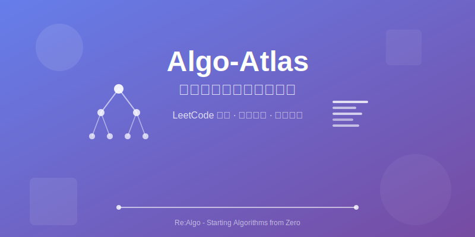

# Algo-Atlas

> **Re:Algo** — 从零开始的算法学习之路

<p align="center">
  
</p>

## 📚 项目介绍

本仓库用于整理和分享 LeetCode 算法题的解题思路和代码实现。通过系统的分类和标记，帮助自己和他人更好地理解和掌握常见的算法模式。
当前正在**持续更新中**，因为我学的嵌入式，我的目标就是难度会在中上等，我任务更重要的是写得出、讲得清、复杂度说得明白，而不是去打ACM = -=

---

## 🚀 快速开始

### 克隆仓库

欢迎clone/fork本仓库，不会的话可以先去问AI，例如把仓库地址发给它，让它告诉你。
```bash
git clone https://github.com/LZJ-I/Algo-Atlas.git
cd Algo-Atlas
```

### 环境配置

所谓“工欲善其事，必先利其器”，配置好环境可以让坐在电脑前刷题变的更加快乐：[vscode/cursor 刷题插件](https://labuladong.online/zh/algo/intro/vscode/)(这里我用的**不是官方的LeetCode插件**，因为他的登录经常有问题。这个第三方有些广告，但不影响体验)
题单：[分享｜如何科学刷题？](https://leetcode.cn/discuss/post/3141566/ru-he-ke-xue-shua-ti-by-endlesscheng-q3yd/)(可以参考，但还是要按自己的实际情况来)

## 碎碎念

在当前时代，AI是你最好的老师，要学会使用AI来辅助学习。
遇到不认识的库？看不懂的算法？都可以让它来解决，但前提是你能明确的提问。
“提问的复杂度，决定了AI对你的回答是否专业”
针对平时做题，如果不懂，可以去bilibili搜算法讲解或者让AI大哥给你生成最优算法的动态动画，我放一套提示词
```
请把下面这个算法做成一个单文件 HTML 教学动画网页，要求支持单步执行、上一步、下一步、自动播放、进度条跳转、伪代码高亮、变量状态展示、当前步骤解释。
页面要用 Tailwind CSS 做成现代卡片风格，适合初学者学习。
请把算法拆成多个 snapshot 步骤来驱动动画，每一步都展示：

当前阶段
当前下标 / 指针
关键变量
当前公式
当前说明文字
被高亮的数据项
对应伪代码行
输出必须是完整可运行的单文件 HTML，不要省略任何代码。
算法代码如下：

（贴代码）
```

### 推荐工具

- **IDE/编辑器** - VSCode、CLion 等

---

## 💡 建议和反馈

如果您对本仓库的内容有任何建议或发现错误，欢迎：

- 提交 Issue 提出问题
- 提交 Pull Request 贡献改进
- 通过 Email 或其他方式交流讨论

---

## 📄 许可证

本仓库代码和文档均开源，欢迎自由获取、引用和改造。

---

## 🙏 致谢

感谢所有为算法学习做出贡献的人，希望这个仓库能帮助更多人学习和进步！

---

**最后的话：** 刷题重在坚持和思考，不在数量。每一题都是一次思维的锻炼，每一次失败都是学习的机会。加油！ 💪
